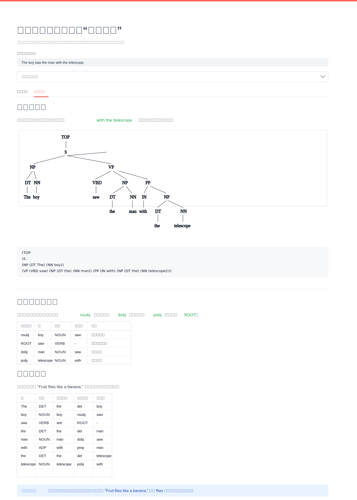

# 句法双引擎透视仪

一个可复用的英文句法分析 Web 工具，用同一段文本同时观察 **依存句法**、**成分句法** 和 **核心论元结构**。它适合用于 NLP 原型验证、语言学分析、歧义句诊断、解析器输出对比，以及把模型结果整理成更直观的可视化材料。

## 页面概览



应用以 Streamlit 构建，输入一句英文后即可切换查看成分结构树、依存关系图，并在页面下方自动抽取主语、宾语、介词宾语与根节点等关键依存弧。

## 核心能力

- **依存句法可视化**：使用 spaCy 与 displaCy 渲染词与词之间的支配关系。
- **成分句法可视化**：使用 benepar 生成短语层级树，并通过 svgling 图形化展示。
- **歧义结构观察**：适合分析介词短语附着、词性歧义、短语边界等结构问题。
- **核心论元提取**：自动抽取 `ROOT`、`nsubj`、`dobj`、`obj`、`pobj` 等关键关系。
- **逐词分析表**：展示词性、词形还原、依存标签和中心词，便于快速定位模型判断。
- **环境友好**：启动时会检测缺失依赖和模型，并尝试自动安装或下载。

## 适用场景

- 对英文句子进行快速句法诊断。
- 对比依存句法与成分句法的不同视角。
- 展示解析器如何处理结构歧义。
- 为技术报告、模型 demo、语言学分析或解析器调试提供可视化界面。
- 作为 Streamlit + spaCy + benepar 的轻量级可复用模板。

## 快速开始

建议使用虚拟环境运行，避免和本机其他 Python 项目互相影响。

```bash
python3 -m venv .venv
source .venv/bin/activate
pip install -r requirements.txt
streamlit run app.py
```

首次启动可能会慢一些，因为应用会下载 `en_core_web_sm` 和 `benepar_en3` 等模型资源。

## 示例输入

可以先用下面两个句子测试工具效果：

```text
The boy saw the man with the telescope.
```

这个句子适合观察 `with the telescope` 到底附着在名词短语还是动词短语上。

```text
Fruit flies like a banana.
```

这个句子适合观察模型会把 `flies` 判断为动词还是名词。

## 项目结构

```text
.
├── app.py
├── requirements.txt
├── README.md
└── docs/
    └── page-overview.svg
```

## 技术栈

- Streamlit：页面交互与布局
- spaCy：依存句法分析与词性标注
- displaCy：依存关系 SVG 渲染
- benepar：成分句法分析
- svgling：成分树图形化展示
- NLTK：分词辅助

## 说明

如果 benepar 在某些环境中安装失败，依存句法页签仍然可以正常使用。成分句法部分可以根据需要替换为 NLTK CFG、Stanza 或其他解析器。
